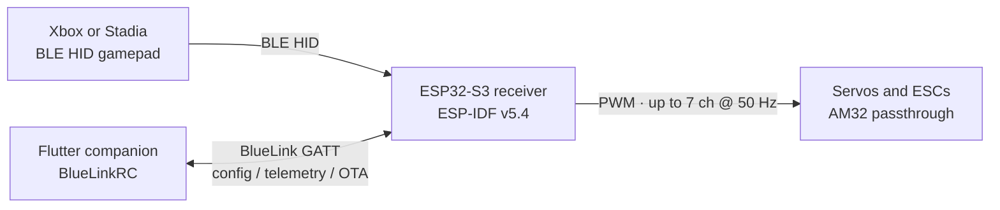

# BlueLink RC

**Drive RC vehicles with an Xbox or Stadia controller over Bluetooth Low Energy.**

BlueLink RC is a personal/indie project that turns a BLE HID gamepad into an RC transmitter. Custom firmware on an ESP32-S3 acts as the receiver: it binds to the controller, runs a signal-processing pipeline, and drives servos and ESCs over PWM. A Flutter companion app talks to the same board over a custom BLE GATT service so you can remap channels, watch telemetry, and push OTA firmware updates without a USB cable.

This repository is the public homepage for the [Bluelink-RC](https://github.com/Bluelink-RC) organization. Implementation work continues in private repos; this page is the architecture and status overview you can share on LinkedIn, portfolios, and job applications.

## Architecture



```
  Xbox / Stadia controller
            │  BLE HID
            ▼
  ┌─────────────────────────────────────┐
  │  ESP32-S3 receiver (ESP-IDF v5.4)  │
  │  HID client · signal pipeline · PWM │
  │  BlueLink GATT · AM32 · WS2812B     │
  └──────────────┬──────────▲───────────┘
                 │          │
          PWM 50 Hz    BLE GATT
                 │          │
                 ▼          │
        Servos / ESCs   Flutter app
```

**Control path:** gamepad → BLE HID → firmware pipeline → PWM outputs.

**Config path:** Flutter app ↔ custom “BlueLink” GATT (channel map, telemetry, OTA). The radio link for driving the vehicle is the controller, not the phone.

## Features

Honest inventory of what exists today — not a product roadmap.

### Receiver firmware (ESP32-S3 / ESP-IDF v5.4)

- BLE HID **client** for Xbox and Stadia controllers
- Signal pipeline: deadband, expo, MLA mixing, dig/turbo
- Up to **7 PWM channels at 50 Hz**
- Custom BLE GATT service (“BlueLink”) for configuration, telemetry, and OTA
- AM32 ESC passthrough
- WS2812B status LEDs
- Host-side Unity tests plus Python cross-validation
- GitHub Actions CI on the firmware repo

### Flutter companion (BlueLinkRC)

- Remap channels without reflashed firmware
- Live telemetry over BLE
- OTA firmware updates over the BlueLink GATT service
- Android, iOS, and desktop targets exist in the org

## Hardware

The current **verified** board is the [Seeed XIAO ESP32-S3](https://www.seeedstudio.com/XIAO-ESP32S3-p-5627.html). Firmware targets ESP32-S3 on ESP-IDF v5.4. Other ESP32-S3 modules may work; they are not the tested reference.

## Testing and CI

Firmware is exercised on the host (no board required for the unit suite) with Unity tests and a Python cross-validation layer. GitHub Actions runs that suite on the private firmware repository. This overview repo is documentation-only and does not ship firmware binaries.

## Repository map

| Repo | Role | Visibility |
| --- | --- | --- |
| **`bluelink-rc`** (this repo) | Public overview: product, architecture, status | **Public** |
| `receiver-firmware` | ESP-IDF firmware, signal pipeline, PWM, GATT, CI | Private |
| `mobile-app` | Flutter companion (BlueLinkRC) | Private |
| `cloud-platform` | Cloud services | Private |
| `device-ops` | Device operations | Private |
| `bluelink-control-plane` | Control plane | Private |
| Older / frozen repos | Historical snapshots; not the current source of truth | Mixed / historical |

Private implementation continues. Org visitors should treat **this README** as the public description of how the pieces fit. Source, board pin maps, and GATT details live in private repos and are not published here.

## Status

**Active personal/indie project.** BlueLink RC is real hardware and software Lincoln Larson is building and using — not a commercial product, not a company offering, and not a claim of production support or a public SDK.

Firmware and the companion app are under active development. Public issues on this repo are welcome for documentation and overview questions; firmware-level contributions are not open yet.

## Author

[Lincoln Larson](https://github.com/modernn) · GitHub org: [Bluelink-RC](https://github.com/Bluelink-RC)

## License

**License TBD.** This overview repository does not currently carry a `LICENSE` file. A permissive license (MIT or Apache-2.0) is the intended direction; that choice is still pending and should not be assumed. Do not treat this repo, or the private implementation, as licensed for reuse until a license is published.

See [CONTRIBUTING.md](CONTRIBUTING.md) if you want to report a documentation issue.
