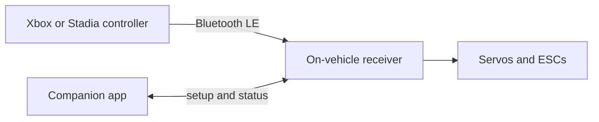

# BlueLink RC

**Drive RC vehicles with an Xbox or Stadia controller over Bluetooth Low Energy.**

BlueLink RC is a personal/indie project: a small on-vehicle receiver plus a companion app. A BLE gamepad is the transmitter. Firmware on the receiver turns stick and button input into standard RC outputs for servos and speed controllers. The companion app is for setup and status on the bench — it is not the driving radio.

This repository is the **public homepage** for [Bluelink-RC](https://github.com/Bluelink-RC). It is documentation only. It does not contain source code, firmware, schemas, credentials, or operational infrastructure.

## How it fits together



```
  Gamepad  -- Bluetooth LE -->  Receiver  -->  Servos / ESCs
                                    ^
                                    |
                              Companion app
                           (setup and status)
```

You drive with the controller. The app is for configuration and live status, not for piloting the vehicle.

## What exists today

- Receiver firmware on ESP32-S3 that speaks BLE to Xbox and Stadia controllers and outputs PWM to RC hardware
- Companion app (Flutter) for channel mapping, live status, and wireless firmware updates
- Verified development board: [Seeed XIAO ESP32-S3](https://www.seeedstudio.com/XIAO-ESP32S3-p-5627.html)

Firmware and app work continue in private repositories. This public repo is not a source dump and is not a map of those systems.

## Public boundary

Published here on purpose:

- Product description and high-level architecture (above)
- Project status and how to reach the author

**Not published** — and please do not ask for them in public issues:

- Source, board pinouts, protocols, or update internals
- Internal repository names, cloud or operations layout, environments, or endpoints
- Credentials, keys, device inventories, or build/release machinery

If you believe you have found a security issue, do **not** file a public GitHub issue with details. Contact the author privately (see below).

## Status

**Active personal/indie project.** Real hardware and software, not a commercial product, company offering, public SDK, or supported service.

## Author

[Lincoln Larson](https://github.com/modernn) · org: [Bluelink-RC](https://github.com/Bluelink-RC)

## License

**License TBD.** There is no `LICENSE` file in this repository. Until one is published, nothing here (and nothing in private implementation) should be treated as licensed for reuse. A permissive license (MIT or Apache-2.0) is the likely direction; that is not a grant.

See [CONTRIBUTING.md](CONTRIBUTING.md) for what belongs on this public repo.
